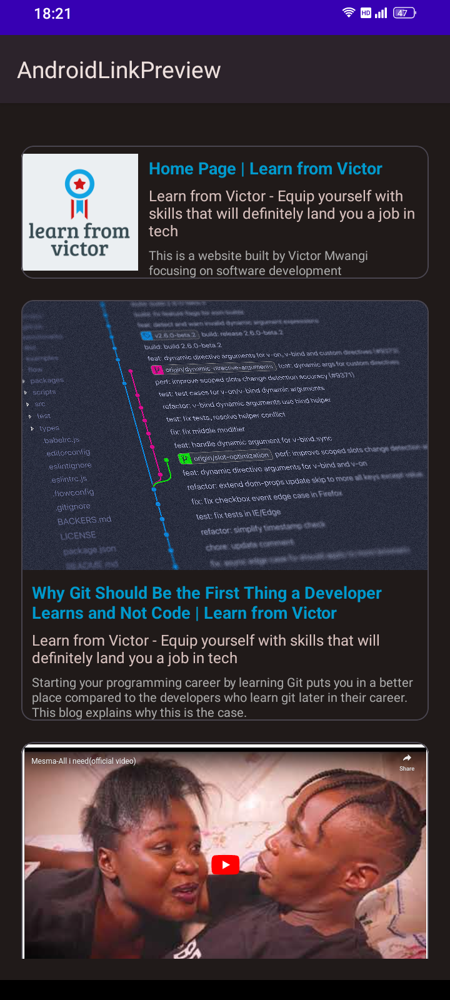
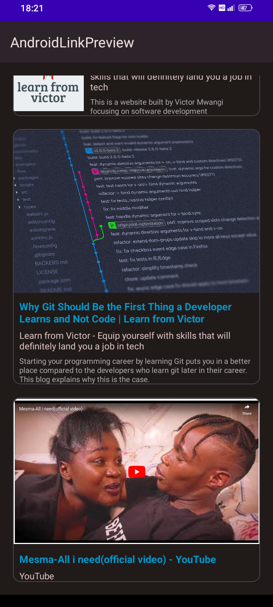
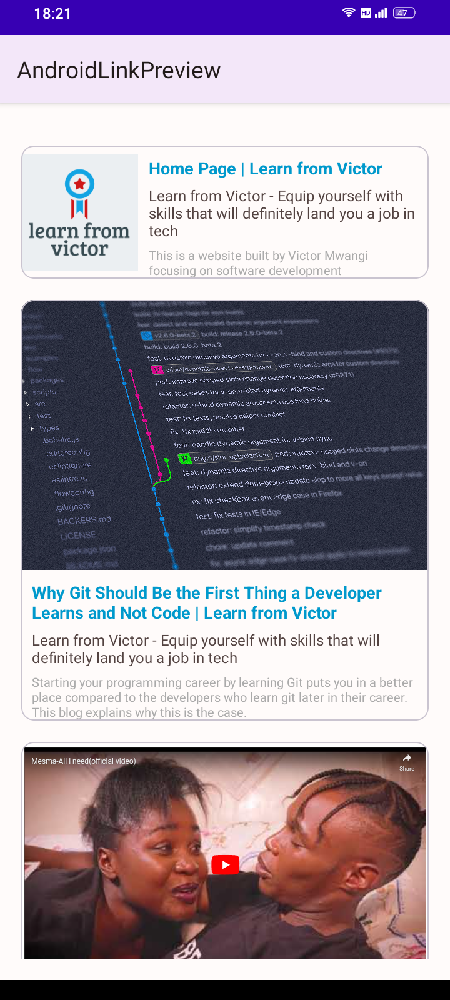
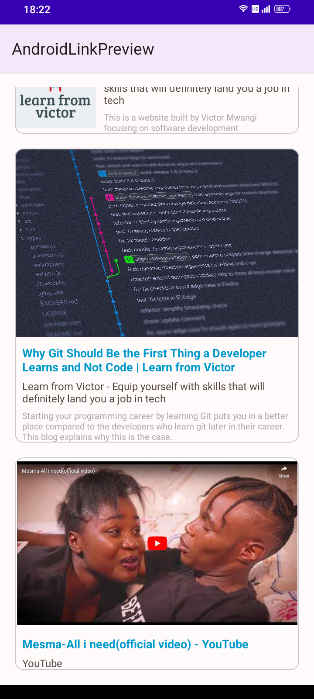
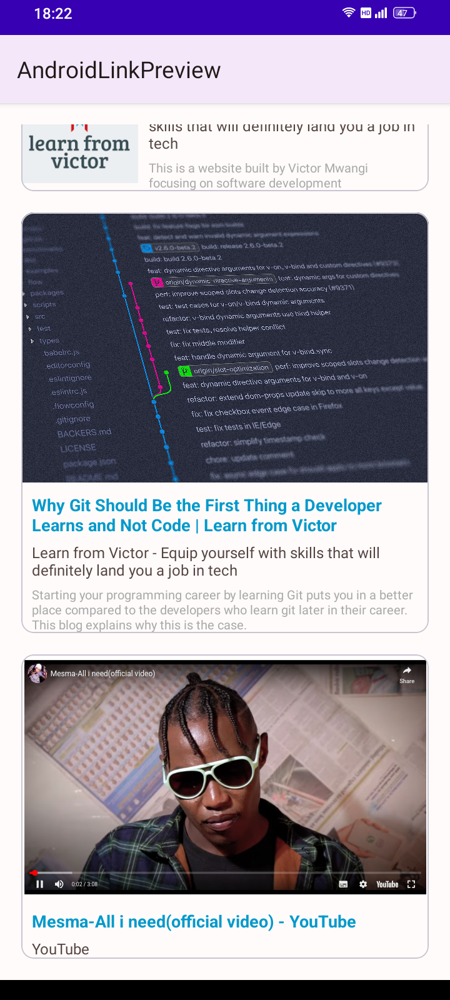

# Android-Links-Preview
## Introduction
This is a library meant for providing rich previews for links in an android application. The library uses the java and xml views ecosystem. It utilises material3 cards which means that the preview backgrounds changes depending on the system light or dark themes and is also compatible with adaptive theming from android 12 and above.  






The card to be used is determined automatically by the library.
## Installation
Add jitpack package repository to you project by adding the following under repositories in dependency resolution management in settings.gradle.kts

```kotlin
dependencyResolutionManagement {
    ...
    repositories {
        ...
        maven {
            setUrl("https://jitpack.io")
        }
    }
}
```
or the following if you are using settings.gradle
```groovy
dependencyResolutionManagement {
    ...
    repositories {
        ...
        maven { 
            url 'https://jitpack.io' 
        }
    }
}
```
Then add the following dependency in (check latest version in releases):  
-> build.gradle.kts
```kotlin
dependencies {
    implementation("com.github.vikie1:Android-Links-Preview:1.1.3")
}
```
-> build.gradle
```groovy
dependencies {
    implementation 'com.github.vikie1:Android-Links-Preview:1.1.3'
}
```
## Instructions
The library is simple to use by default. Add this to your layout file:
```xml
<com.github.vikie1.linkpreview.Preview
    android:layout_width="match_parent"
    android:layout_height="wrap_content"
    android:id="@+id/link_preview"
    android:layout_margin="20dp"
    ...
    />
```
Then specify the links programatically.
```java
Preview linkPreview = findViewById(R.id.link_preview);
linkPreview.setData("https://learnfromvictor.netlify.app/");
```
Clicking the preview invokes `Intent.ACTION_VIEW` to open the link. To add custom click functionality:
```java
linkPreview.setOnClickListener(preview -> {
    // TODO: Add click action
}); // lambda version
```
or
```java
linkPreview.setOnClickListener(new PreviewListener{
    @overide
    void onDataReady(Preview preview){
        // TODO: Add click action
    }
})
```

The library also uses youtube iframe API to play youtube videos in app. The auto play flag is set to off in the embedded youtube player. If for any reason the iframe isn't shown by the system webview, then the library defaults to the normal preview using youtube video cover photo.  
For more instructions check <https://learnfromvictor.netlify.app/blog/how-to-create-rich-previews-for-website-links-in-your-android-app/>

### Credits
This project is a modified fork of <https://github.com/FreesoulApps/PreviewAndroid.git> project by [Alex Vainshtein](https://github.com/FreesoulApps)  
First link: <https://learnfromvictor.netlify.app/>  
Second link: <https://learnfromvictor.netlify.app/blog/why-git-should-be-the-first-thing-a-developer-learns-and-not-code/>  
Demo youtube video: <https://youtu.be/WaE4townngA>
